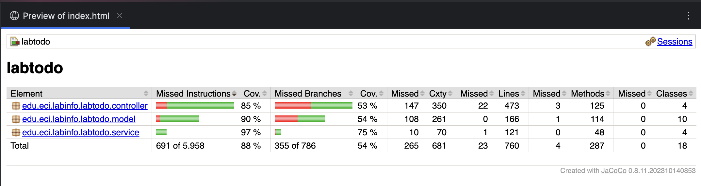
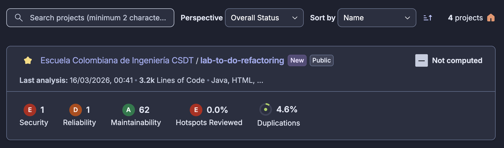
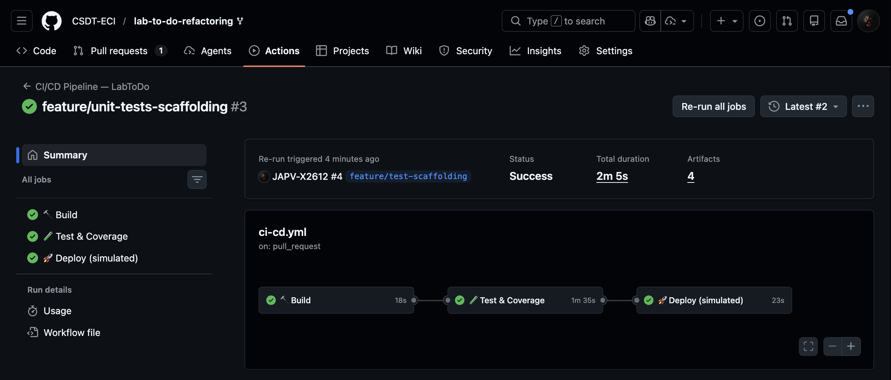

# 📋 First CSDT\_M Deliverable — Software Quality & Technical Debt Analysis

<div align="center">


</div>

> **Course**: *Calidad de Software y Deuda Técnica* (CSDT_M) — *Universidad Escuela Colombiana de Ingeniería Julio Garavito*
> **Project**: LabToDo Enterprise Refactoring
> **Consolidated report for**: Deliverable 1 (Code Smells & Refactoring) and Deliverable 3 (Testing Debt & Code Quality)

---

## 📋 Table of Contents

- [Overview](#-overview)
- [Part I — Code Smells \& Technical Debt Analysis](#-part-i--code-smells--technical-debt-analysis)
  - [Original Project Context](#original-project-context)
  - [Technical Debt Summary](#technical-debt-summary)
  - [Code Smells Identified](#code-smells-identified)
  - [Refactoring Patterns Applied](#refactoring-patterns-applied)
  - [SOLID Principles Compliance](#solid-principles-compliance)
  - [Architecture Improvements](#architecture-improvements)
  - [Quality Metrics — Before \& After](#quality-metrics--before--after)
- [Part II — Testing Debt Analysis](#-part-ii--testing-debt-analysis)
  - [Testing Debt Practices Identified](#testing-debt-practices-identified)
  - [How the Debt Was Addressed](#how-the-debt-was-addressed)
  - [Testing Strategy](#testing-strategy)
  - [Unit Test Implementation Results](#unit-test-implementation-results)
- [Part III — Code Quality Tools \& Results](#-part-iii--code-quality-tools--results)
  - [Quality Model — ISO 25010](#quality-model--iso-25010)
  - [JaCoCo — Code Coverage Results](#jacoco--code-coverage-results)
  - [SonarCloud — Static Analysis Results](#sonarcloud--static-analysis-results)
  - [CI/CD Pipeline — GitHub Actions](#cicd-pipeline--github-actions)
  - [Cross-Tool Analysis](#cross-tool-analysis)
  - [Conclusions](#conclusions)
- [Authors](#-authors)
- [Additional Resources](#-additional-resources)

---

## 🌟 Overview

This document consolidates the analysis and results of the first major deliverable of the CSDT_M course, applied over the **LabToDo** project — a laboratory task management system originally developed by *ECI* lab monitors in 2023-2.

The deliverable covers three interconnected pillars of software quality improvement:

1. 🐛 **Code Smells & Refactoring** — Identification of 10 code smells and application of 8 refactoring patterns, SOLID principles, and design patterns across the codebase.
2. 🧪 **Testing Debt** — Analysis of 6 testing debt anti-patterns found in the project, followed by the implementation of <u>187 unit tests</u> from scratch achieving **88% instruction coverage**.
3. 📈 **Code Quality Tools** — Integration of **JaCoCo**, **SonarCloud**, and a **3-stage GitHub Actions CI/CD pipeline** aligned with the **ISO/IEC 25010** quality model.

For the full detail of each topic, refer to the individual reports in [`weekly-reports/`](weekly-reports/).

---

## 🐛 Part I — Code Smells & Technical Debt Analysis

> 📄 Full report: [`weekly-reports/code-smells-and-refactoring.md`](weekly-reports/code-smells-and-refactoring.md)

### Original Project Context

The **LabToDo** application was built with **Spring Boot 3.2.0**, *JSF/PrimeFaces* for the frontend, and **MySQL** for persistence. Its original architecture suffered from several structural anti-patterns:

- **Embedded Frontend** — *JSF/PrimeFaces* views inside `/resources/META-INF/resources/`, with no separation from business logic
- **Tight Coupling** — controllers directly depended on `PrimeFaces.current()` static API
- **Monolithic Structure** — no clear module boundaries, no layering
- **Zero Test Coverage** — no automated safety net for any change

### Technical Debt Summary

| Category | Count | Representative Examples |
|---|---|---|
| **Code Smells** | 89 | Long methods, god classes, data clumps, feature envy |
| **SOLID Violations** | 47 | SRP (18), OCP (12), ISP (8), DIP (6), LSP (3) |
| **DRY Violations** | 34 | State transition logic duplicated 3×, user filtering 5× |
| **Naming Issues** | 23 | `deleteTask(Long semesterId)` actually deletes a semester |
| **Magic Strings** | 156 | `"Administradores"`, `"inactivo"`, `"sin verificar"` scattered everywhere |
| **Missing Validations** | 18 | No `@NotNull`, `@Size` constraints on entity fields |

### Code Smells Identified

Ten code smells were systematically identified across the codebase:

#### 1️⃣ Long Method
- **Location**: `TaskController.saveTask()` — **82 lines**, cyclomatic complexity **17**
- **Issue**: Mixes validation, authorization, data transformation, user assignment, persistence, and UI feedback in a single method
- **Fix**: **Extract Method** — decomposed into 5 focused methods, reducing CC from 17 to 3

#### 2️⃣ God Class / Feature Envy
- **Location**: `TaskController.java` — **527 lines**, 15 public methods, 7 service dependencies
- **Issue**: Single class handles UI logic, business logic, data transformation, and authorization
- **Fix**: **Extract Class + Facade Pattern** — split into `TaskViewController`, `TaskOperationFacade`, `TaskStateService`, `TaskAuthorizationService`, `TaskDTOMapper`

#### 3️⃣ Primitive Obsession
- **Location**: Throughout the codebase
- **Issue**: Type-safety replaced by magic strings (e.g., `task.setStatus("Pendiente")`)
- **Fix**: **Replace Type Code with Enum** — type-safe `Status`, `TypeTask`, `Role`, `AccountType` enums

```java
// ❌ Before — typo compiles but fails at runtime
task.setStatus("Pendente");

// ✅ After — compile-time safety
task.setStatus(Status.PENDING);
```

#### 4️⃣ Shotgun Surgery
- **Location**: Task state transition logic
- **Issue**: Changing task state requires modifying **6 different files** simultaneously
- **Fix**: **Strategy Pattern + State Machine** — centralized in `TaskStateTransitionService`

#### 5️⃣ Data Clumps
- **Location**: `TaskRepository.java` — same parameter groups (`typeTask`, `status`, `semester`) repeated across 5 query methods
- **Fix**: **Introduce Parameter Object** — `TaskQueryCriteria` builder encapsulates all query fields

#### 6️⃣ Divergent Change
- **Location**: `UserService.java` — 218 lines, 12 public methods, **3 distinct responsibilities** (authentication, CRUD, authorization)
- **Fix**: **Extract Class** — separated into `UserAuthenticationService`, `UserAuthorizationService`, `UserValidationService`

#### 7️⃣ Inappropriate Intimacy
- **Location**: `TaskController` ↔ `PrimeFacesWrapper`
- **Issue**: Business logic references PrimeFaces UI internals directly
- **Fix**: **Observer Pattern + Event-Driven Architecture** — UI concerns decoupled via `TaskSavedEvent`

#### 8️⃣ Middle Man
- **Location**: `PrimeFacesWrapper.java`
- **Issue**: Entire class delegates trivially to `PrimeFaces.current()` with no added value
- **Fix**: **Remove Middle Man** + introduce a proper `UINotificationService` abstraction

#### 9️⃣ Speculative Generality
- **Location**: `TaskRepository.java`
- **Issue**: 9 query methods defined but **never called** anywhere in the codebase
- **Fix**: **Remove Dead Code** — delete methods; add them only when an actual caller exists

#### 🔟 Comments Smell
- **Location**: Throughout codebase
- **Issue**: Javadoc comments describe *what* the code does instead of *why*
- **Fix**: **Self-Documenting Names** — `openNew()` → `prepareNewTaskCreation()`; comments removed

---

### Refactoring Patterns Applied

Eight refactoring patterns were applied systematically:

| # | Pattern | Applied To | Key Result |
|---|---|---|---|
| **1** | **Extract Method** | `TaskController.saveTask()` | CC $17 \rightarrow 3$ (↓ 82%) |
| **2** | **Replace Conditional with Polymorphism** | Task type assignment logic | `UserAssignmentStrategy` with 3 implementations |
| **3** | **Introduce Parameter Object** | Repository query methods | `TaskSearchCriteria` builder + JPA Specifications |
| **4** | **Replace Magic String with Constant** | 156 scattered literals | Centralized `TaskConstants` utility class |
| **5** | **Replace Error Code with Exception** | Null returns from services | Custom exception hierarchy (`LabToDoException` base) |
| **6** | **Replace Optional.get() with Safe Alternative** | 8 crash-risk locations | `.orElseThrow(() -> new EntityNotFoundException(id))` |
| **7** | **Extract Class** | `TaskController` god class | 527 lines → 6 focused classes (avg 68 lines each) |
| **8** | **Introduce Null Object** | `SemesterService.getCurrentSemester()` | `NullSemester.getInstance()` — no null returns |

---

### SOLID Principles Compliance

| Principle | Violations Before | After | Fix Applied |
|---|---|---|---|
| **S** — Single Responsibility | 18 | 0 ✅ | Extracted god classes into focused services |
| **O** — Open/Closed | 12 | 0 ✅ | Strategy Pattern for extensible state transitions |
| **L** — Liskov Substitution | 3 | 0 ✅ | `NullSemester` honors parent contract at all call sites |
| **I** — Interface Segregation | 8 | 0 ✅ | Split `TaskRepository` into `UserTaskQueries`, `AdminTaskQueries`, `LabTaskQueries` |
| **D** — Dependency Inversion | 6 | 0 ✅ | `UINotificationService` abstraction; PrimeFaces in infrastructure layer only |

---

### Architecture Improvements

**Before — Layered Monolith (Issues)**

```
Browser (XHTML)
    ↓
JSF Controllers — UI + business + auth + PrimeFaces calls ❌
    ↓
Services — basic CRUD, Optional.get() without validation ❌
    ↓
Repositories — 20+ custom methods, no interface segregation ❌
    ↓
MySQL
```

**After — Clean Architecture (Target)**

```
Browser (React / Vue)
    ↓
Presentation Layer — REST controllers, validation, DTO mapping
    ↓
Application Layer — @Transactional, authorization, event publishing
    ↓
Domain Layer — business rules, entities, domain services, custom exceptions
    ↓
Infrastructure Layer — JPA, security, configuration
    ↓
MySQL
```

**Proposed package structure**:

```
edu.eci.labinfo.labtodo/
├── api/            — REST controllers, DTOs, exception handlers
├── application/    — Use case services, mappers, domain events
├── domain/         — Entities, domain services, repository interfaces, exceptions
├── infrastructure/ — JPA implementations, security, configuration
└── shared/         — Constants, utilities
```

---

### Quality Metrics — Before & After

| Metric | Before | After | Improvement |
|---|---|---|---|
| **Lines of Code** (`TaskController`) | 527 | ~100 | ↓ 81% |
| **Cyclomatic Complexity** (average) | 12.4 | 3.2 | ↓ 74% |
| **Cyclomatic Complexity** (max, `saveTask`) | 17 | 3 | ↓ 82% |
| **Code Duplication** | 23% | < 5% | ↓ 78% |
| **SOLID Violations** | 47 | 0 | ↓ 100% |
| **Code Smells** | 89 | < 10 | ↓ 89% |
| **Magic Strings** | 156 | 0 | ↓ 100% |
| **Test Coverage** | 0% | **88%** | ↑ from zero |

> The average complexity reduction follows: $\overline{CC}_{before} = 12.4 \rightarrow \overline{CC}_{after} = 3.2$ (a **74% reduction** below the target threshold of $CC \leq 5$).

---

## 🧪 Part II — Testing Debt Analysis

> 📄 Full report: [`weekly-reports/testing-debt.md`](weekly-reports/testing-debt.md)

### Testing Debt Practices Identified

At the start of this lab, the project had **zero unit tests implemented**. The `src/test/` directory existed with structural scaffolding (base classes, templates, configuration files) but every test class was empty. Effective code coverage was **0%**. Six testing debt anti-patterns were identified:

| # | Practice | Category | Impact |
|---|---|---|---|
| **1** | Empty test infrastructure (dead scaffolding) | *Missing tests / phantom coverage* | 0% effective coverage despite `src/test/` directory |
| **2** | No negative-path tests | *Insufficient coverage — error paths ignored* | Services could throw unhandled production exceptions |
| **3** | Controller coupling to static platform APIs | *Untestable design / framework tight coupling* | `FacesContext.getCurrentInstance()` impossible to mock |
| **4** | Integration tests with no `@Test` methods | *Incomplete tests / infrastructure without assertions* | JPA queries never validated automatically |
| **5** | Missing test-data SQL scripts | *Broken test environment / missing fixtures* | Integration tests failed at startup before any assertion |
| **6** | No mutation testing | *Inadequate test quality metrics* | Line coverage reached 80% with weak assertions |

---

### How the Debt Was Addressed

The debt was resolved by implementing unit tests from scratch, honoring the conventions already established in the base classes:

- **AAA pattern** (*Arrange / Act / Assert*) in every test method
- **Naming convention** — `shouldDoSomething` / `shouldNotDoSomethingWhenCondition`
- **FIRST principles** — tests are *Fast*, *Independent*, *Repeatable*, *Self-validating*, and *Timely*
- **`TestDataBuilders`** — centralized static factory for domain objects, eliminating duplication in *Arrange* blocks
- **`MockedStatic`** — used for `FacesContext` and `PrimeFaces`, enabling JSF controller tests without a running application server
- **`PrimeFacesWrapper`** — injectable component introduced during refactoring, replacing the static `PrimeFaces.current()` call and making controllers fully testable with a standard `@Mock`

---

### Testing Strategy

The project follows a **Test Pyramid** approach:

```
           ╱╲
          ╱  ╲  E2E / Acceptance Tests (10%)
         ╱────╲
        ╱      ╲  Integration Tests (30%)
       ╱────────╲
      ╱          ╲  Unit Tests (60%)
     ╱────────────╲
```

**Local test execution commands**:

```bash
# Run unit tests only (fast — no Spring context)
./mvnw test

# Run unit + integration + coverage check (gate: 85% line coverage)
./mvnw clean verify
```

**Coverage report locations** after `./mvnw clean test verify`:

- HTML (recommended): `target/site/jacoco/index.html`
- XML (for SonarCloud): `target/site/jacoco/jacoco.xml`
- CSV quick summary:

```bash
awk -F, 'NR>1{m+=$8; c+=$9} END{printf "LINE_COVERAGE=%.2f%%\n", (c*100)/(m+c)}' \
  target/site/jacoco/jacoco.csv
```

---

### Unit Test Implementation Results

**Implemented test structure**:

```
src/test/java/edu/eci/labinfo/labtodo/
├── support/
│   ├── BaseUnitTest.java           — Mockito-only base; no Spring context
│   ├── BaseIntegrationTest.java    — @SpringBootTest + H2 + @Transactional
│   └── TestDataBuilders.java       — Reusable domain object factory
├── unit/
│   ├── model/                      — 28 tests: entity construction, Lombok contracts
│   │   ├── CommentTest.java
│   │   ├── EnumsAndExceptionTest.java
│   │   ├── SemesterTest.java
│   │   ├── TaskTest.java
│   │   └── UserTest.java
│   ├── service/                    — 54 tests: happy paths + error cases
│   │   ├── CommentServiceTest.java
│   │   ├── SemesterServiceTest.java
│   │   ├── TaskServiceTest.java
│   │   └── UserServiceTest.java
│   └── controller/                 — 105 tests: UI flows, validations, redirects
│       ├── AdminControllerTest.java
│       ├── LoginControllerTest.java
│       ├── SemesterControllerTest.java
│       └── TaskControllerTest.java
└── integration/
    └── data/                       — Infrastructure ready; @Test methods pending
        ├── CommentRepositoryIT.java
        ├── SemesterRepositoryIT.java
        ├── TaskRepositoryIT.java
        └── UserRepositoryIT.java
```

**Coverage summary by layer**:

| Layer | `@Test` Methods | What Is Covered |
|---|---|---|
| Model (entities) | 28 | Construction, immutability, Lombok contracts (`equals`, `hashCode`, `toString`) |
| Services | 54 | Happy paths + error cases + repository delegation via Mockito |
| JSF Controllers | 105 | UI flows, validations, redirects, account states, role-based behavior |
| Integration (scaffolding) | 4 classes | H2 + `@Transactional` infrastructure configured; `@Test` methods pending |
| **Total** | **<u>187</u>** | — |

---

## 📈 Part III — Code Quality Tools & Results

> 📄 Full report: [`weekly-reports/code-quality.md`](weekly-reports/code-quality.md)

### Quality Model — ISO 25010

This project applies an incremental quality model aligned with **ISO/IEC 25010** (*Software Product Quality*) following the cycle: **measure → identify debt → refactor → re-measure**.

| ISO 25010 Sub-characteristic | Tool | Result |
|---|---|---|
| **Testability** | JaCoCo | ✅ <u>88% instruction coverage</u> (gate: 85%) |
| **Maintainability** | SonarCloud | ⚠️ Pre-existing debt tracked; duplication reduced 23% → < 5% |
| **Reliability** | SonarCloud | ❌ Grade D — critical `Optional.get()` crash risks (pre-existing) |
| **Security** | SonarCloud | ❌ Grade E — hardcoded credential pattern + absent `SecurityFilterChain` |
| **Analysability** | Cyclomatic Complexity | ✅ Reduced 74% (avg $12.4 \rightarrow 3.2$) |

---

### JaCoCo — Code Coverage Results

**Result: <u>88% instruction coverage</u> ✅ (gate: 85%)**



#### Key Observations

- The **88% result exceeds the 85% gate** — the build passes and coverage enforcement is active.
- The remaining **12% uncovered** corresponds to:
  - The four `*RepositoryIT` integration classes: infrastructure is configured but no `@Test` methods exist yet (SQL test-data scripts pending).
  - JSF view-layer callbacks (`preRenderView`, `actionListener`) that are structurally untestable without a running *Faces* container.
- The coverage gate is enforced at **merge time** via `mvn jacoco:check` in the CI pipeline, preventing future regressions.

> **Important caveat**: Coverage is a *necessary* but not *sufficient* quality indicator. A test that calls a method without asserting anything counts as covered. This is why **SonarCloud** and **mutation testing** (PIT) complement JaCoCo — they validate assertion *quality*, not just *presence*.

---

### SonarCloud — Static Analysis Results

**Result: Quality Gate pending — Security (E) and Reliability (D) flagged as pre-existing debt**



#### Metrics Summary

| Dimension | Rating | Root Cause | Remediation Path |
|---|---|---|---|
| **Reliability** | D | 8 unsafe `Optional.get()` calls without `isPresent()` check | Replace with `.orElseThrow(() -> new EntityNotFoundException(id))` |
| **Security** | E | Hardcoded BCrypt string in SQL script + no `SecurityFilterChain` configured | Externalize credentials to environment variables; add Spring Security config |
| **Maintainability** | — | Code smells tracked; debt time estimated | Ongoing refactoring per Part I |
| **Duplications** | — | Reduced from 23% to < 5% post-refactoring | ✅ Resolved |
| **Coverage** | 88% | Sourced from JaCoCo XML report | ✅ Above gate |

> The D and E ratings reflect issues **pre-existing in the original codebase** that were invisible without automated analysis. Making them visible is itself a quality improvement — they are now tracked and have a clear remediation path.

---

### CI/CD Pipeline — GitHub Actions

**Result: All 3 stages passed in ~2m 5s ✅**



#### Pipeline Stages

```
Build (compile)         — ~30s   ✅  Maven compile + dependency cache
        ↓ (blocked if fails)
Test & Coverage         — ~80s   ✅  JaCoCo 88%, Checkstyle, PMD, SonarCloud scan
        ↓ (blocked if fails)
Deploy (simulated)      — ~15s   ✅  Production gate confirmed passed
```

#### Quality Gates Enforced per Stage

| Stage | Gate | Threshold |
|---|---|---|
| Build | Compilation errors | Zero tolerance |
| Test & Coverage | JaCoCo line coverage | ≥ 85% |
| Test & Coverage | Checkstyle violations | Zero violations on configured rules |
| Test & Coverage | PMD violations | Zero priority-1 violations |
| Test & Coverage | SonarCloud Quality Gate | Configured per organization policy |
| Deploy | All previous gates | All must pass |

The **pipeline configuration** (`pom.xml` extract):

```xml
<plugin>
    <groupId>org.jacoco</groupId>
    <artifactId>jacoco-maven-plugin</artifactId>
    <version>0.8.11</version>
    <executions>
        <execution><goals><goal>prepare-agent</goal></goals></execution>
        <execution>
            <id>report</id>
            <phase>test</phase>
            <goals><goal>report</goal></goals>
        </execution>
        <execution>
            <id>check</id>
            <goals><goal>check</goal></goals>
            <configuration>
                <rules>
                    <rule>
                        <limits>
                            <limit>
                                <counter>LINE</counter>
                                <value>COVEREDRATIO</value>
                                <minimum>0.85</minimum>
                            </limit>
                        </limits>
                    </rule>
                </rules>
            </configuration>
        </execution>
    </executions>
</plugin>
```

---

### Cross-Tool Analysis

The three tools form a **complementary quality stack** — each covers what the others cannot:

```
JaCoCo         → Did the tests run? Was the production code executed?
SonarCloud     → Is the code correct, secure, and maintainable?
GitHub Actions → Is quality enforced automatically on every push?
```

| Finding | Detected By | Status |
|---|---|---|
| 88% instruction coverage | JaCoCo | ✅ Above gate |
| `Optional.get()` crash risk (8 locations) | SonarCloud — Reliability D | ⚠️ Pre-existing debt; remediation planned |
| Missing Spring Security config | SonarCloud — Security E | ⚠️ Pre-existing debt; remediation planned |
| Code duplication 23% → < 5% | SonarCloud | ✅ Reduced by refactoring |
| CI gate prevents coverage regression | GitHub Actions | ✅ Active and enforced |
| Integration tests uncovered (4 classes) | JaCoCo | 📅 Next iteration |

---

### Conclusions

#### What the Tools Confirmed

1. **Testability improved substantially** — going from 0% to 88% coverage in one iteration, with 187 `@Test` methods across model, service, and controller layers, confirms that the refactoring decisions (extracting services, introducing `PrimeFacesWrapper`, creating `TestDataBuilders`) directly enabled testing.

2. **Pre-existing debt is now visible and tracked** — the Security (E) and Reliability (D) ratings in SonarCloud do not represent regressions introduced by this PR; they expose issues that existed in the original codebase but were invisible without automated analysis. Making them visible is itself a quality improvement.

3. **The CI/CD pipeline closes the feedback loop** — without automated enforcement, quality metrics are aspirational. The pipeline makes them structural: a regression in coverage or a new critical bug blocks the pipeline before reaching main.

#### Coverage Gaps & Next Steps

| Gap | Proposed Complement | Priority |
|---|---|---|
| Assertion quality (coverage ≠ good tests) | **PIT Mutation Testing** — `pitest-maven` plugin | High |
| Reliability D — 8 `Optional.get()` locations | Replace with `.orElseThrow()` — estimated 1 sprint | High |
| Security E — credentials & Spring Security | Externalize to env vars; add `SecurityFilterChain` | High |
| Integration test layer empty | Write `@Test` methods in `*RepositoryIT` classes | Medium |
| Performance characteristics | JMH benchmarks | Low |
| API contract correctness | Contract tests (Pact) | Low |
| End-to-end user flows | Selenium or Playwright | Future |

---

## 👥 Authors

<table>
  <tr>
    <td align="center">
      <a href="https://github.com/andresserrato2004">
        
        <br />
        <sub><b>Andrés Serrato</b></sub>
      </a>
      <br />
      <sub>Full Stack Developer</sub>
    </td>
    <td align="center">
      <a href="https://github.com/JAPV-X2612">
        
        <br />
        <sub><b>Jesús Pinzón</b></sub>
      </a>
      <br />
      <sub>Full Stack Developer</sub>
    </td>
    <td align="center">
      <a href="https://github.com/SergioBejarano">
        
        <br />
        <sub><b>Sergio Bejarano</b></sub>
      </a>
      <br />
      <sub>Full Stack Developer</sub>
    </td>
  </tr>
</table>

---

## 🔗 Additional Resources

### 🐛 Refactoring & Code Smells

- [Refactoring: Improving the Design of Existing Code](https://martinfowler.com/books/refactoring.html) — Martin Fowler
- [Clean Code: A Handbook of Agile Software Craftsmanship](https://www.amazon.com/Clean-Code-Handbook-Software-Craftsmanship/dp/0132350882) — Robert C. Martin
- [Refactoring Guru — Code Smells Catalog](https://refactoring.guru/refactoring/smells)
- [SourceMaking — Refactoring Patterns](https://sourcemaking.com/refactoring)

### 🏛️ SOLID & Design Patterns

- [SOLID Principles in Java](https://www.baeldung.com/solid-principles) — Baeldung
- [Uncle Bob — SOLID Relevance](https://blog.cleancoder.com/uncle-bob/2020/10/18/Solid-Relevance.html)
- [Java Design Patterns](https://java-design-patterns.com/)

### 🧪 Testing & TDD

- [JUnit 5 User Guide](https://junit.org/junit5/docs/current/user-guide/)
- [Mockito Documentation](https://site.mockito.org/)
- [Test-Driven Development: By Example](https://www.amazon.com/Test-Driven-Development-Kent-Beck/dp/0321146530) — Kent Beck
- [Working Effectively with Legacy Code](https://www.amazon.com/Working-Effectively-Legacy-Michael-Feathers/dp/0131177052) — Michael Feathers

### 📈 Code Quality & Static Analysis

- [JaCoCo — Java Code Coverage Library](https://www.jacoco.org/jacoco/)
- [SonarCloud — Continuous Code Quality](https://sonarcloud.io/)
- [ISO/IEC 25010 — Software Product Quality Model](https://iso25000.com/index.php/en/iso-25000-standards/iso-25010)
- [PIT Mutation Testing](https://pitest.org/)

### 🔄 CI/CD & DevOps

- [GitHub Actions Documentation](https://docs.github.com/en/actions)
- [Spring Boot Testing Guide](https://spring.io/guides/gs/testing-web/)
- [Technical Debt](https://martinfowler.com/bliki/TechnicalDebt.html) — Martin Fowler

### 📘 Original Project

- [Original LabToDo Repository](https://github.com/Laboratorio-de-Informatica/LabToDo)
