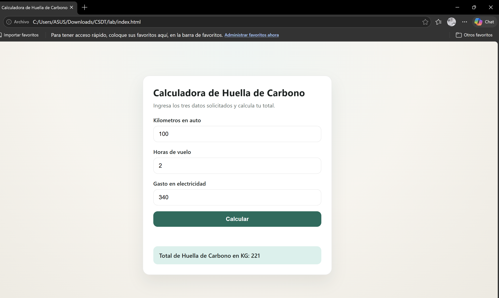
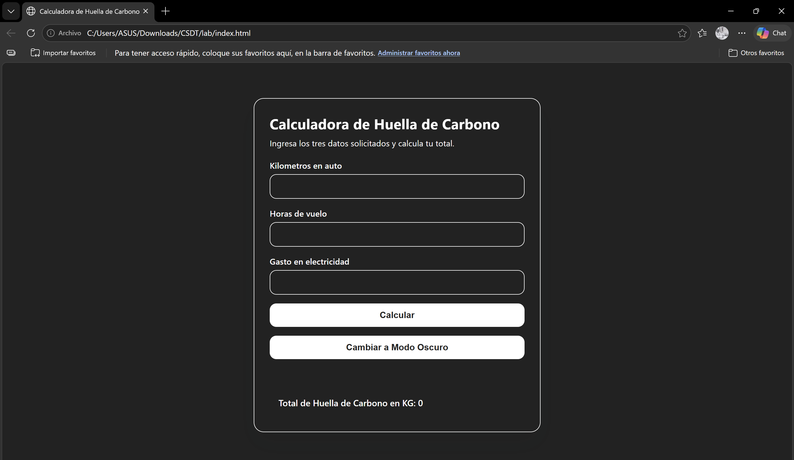

# 🦋 The Butterfly Effect of Code — AIDLC Practical Lab

<div align="center">


</div>

---

## 📋 **Table of Contents**

- [Overview](#-overview)
- [Learning Objectives](#-learning-objectives)
- [Phase 1 — Vibe Coding](#-phase-1--vibe-coding)
    - [Step 1: The Lazy Prompt](#step-1-the-lazy-prompt)
    - [Step 2: The Butterfly Effect](#step-2-the-butterfly-effect-️)
    - [Step 3: The Collapse](#step-3-the-collapse-frankenstein-code-)
    - [Disaster Analysis](#-disaster-analysis)
- [Phase 2 — Spec-Driven Development](#-phase-2--spec-driven-development)
    - [Step 1: The Mega-Prompt](#step-1-the-mega-prompt-context--constraints)
    - [Step 2: Control vs. Chaos](#step-2-control-vs-chaos)
    - [Reflection](#-reflection)
- [Phase 3 — Quality Gate](#-phase-3--quality-gate-ai-red-teaming)
    - [AI Red Teaming](#ai-red-teaming)
    - [Results](#-results)
- [Vibe Coding vs. SDD — Full Comparison](#-vibe-coding-vs-sdd--full-comparison)
- [Project Structure](#-project-structure)
- [Authors](#-authors)
- [License](#-license)
- [Additional Resources](#-additional-resources)

---

## 🌟 **Overview**

This repository contains the practical laboratory for the **AI Driven Development Life Cycle (AIDLC)** course module at _Universidad Escuela Colombiana de Ingeniería Julio Garavito_. The lab demonstrates — through deliberate failure — why *Vibe Coding* (generating software with vague, unstructured prompts) is dangerous in production environments, and how **Spec-Driven Development (SDD)** provides the engineering guardrails needed to keep AI-assisted development under control.

The artifact under construction is an **Agile Carbon Footprint Calculator**: a purely frontend component built with **HTML**, **CSS**, and **JavaScript** — no frameworks, no databases, no backend.

> _"The specification IS the new code. You design; the Copilot programs."_
> — [AIDLC Lab, ECI-ARCN](https://eci-arcn.github.io/AIDLC/laboratorio.html)

---

## 🎯 **Learning Objectives**

- Identify the **failure patterns** produced by unstructured AI prompting (*Vibe Coding*)
- Recognize **anti-patterns** such as *Blind Trust*, *Frankenstein Code*, *Token Sprawl*, and *Context Leak*
- Apply the **Spec-Driven Development** methodology using structured *Mega-Prompts*
- Understand how **AI Red Teaming** functions as a quality gate within the AIDLC pipeline
- Appreciate the tradeoffs between **rapid prototyping** and **production-grade engineering**

---

## 🌀 **Phase 1 — Vibe Coding**

> _Vibe Coding_ occurs when a developer instructs an AI model as if it were magic — without architectural specifications, constraints, or acceptance criteria. The result may look functional at first glance, but structural fragility accumulates with every prompt.

### Step 1: The Lazy Prompt

Copy the following text verbatim into your preferred AI assistant (ChatGPT, Copilot, Cursor, or Gemini) and generate the page:

```
"Hazme una página web bonita para una calculadora de huella de carbono.
Que calcule cosas y se vea moderna."
```

Paste the generated code into an `index.html` file and open it in your browser. It will likely look polished at first sight — "it feels like magic," right?

**Preview:**


> 🎬 [Watch full video: Lazy Prompt](assets/videos/03-lazy-prompt.mp4)

---

### Step 2: The Butterfly Effect 🦋💥

Now request a change that appears simple but will force the AI to make drastic architectural decisions. Send this in the **same chat**:

```
"Ahora haz que los cálculos se guarden en una tabla abajo, añade una gráfica
interactiva súper profesional y haz que los colores dependan del resultado.
Ah, y que se pueda descargar como PDF profesional."
```

**Preview:**


> 🎬 [Watch full video: Butterfly Effect](assets/videos/02-butterfly-effect.mp4)

**Observed failures:**
- The chart did not render correctly
- Colors did not respond dynamically to the result
- The PDF export generated a blank-content document due to a contrast conflict between the dark CSS background and the white PDF background injected by `html2canvas`

---

### Step 3: The Collapse (Frankenstein Code) 🧟

If the code has not yet broken, this final ambiguous prompt will cause the collapse. Send this:

```
"No me gusta el gráfico, quítalo y haz que sea minimalista en una sola tarjeta,
pero mantén la descarga de PDF. Además, ahora los cálculos deben ser mensuales
estimamos por 12 meses, no por año. Arréglalo rápido."
```

**Preview:**


> 🎬 [Watch full video: Collapse](assets/videos/01-collapse.mp4)

**Observed failures:**
- The chart was removed correctly, but the broken PDF export logic persisted untouched
- The monthly calculation fix was applied to the main logic but **not propagated** to the PDF module — a classic case of **incomplete debt resolution**

---

### 🔬 Disaster Analysis

#### 💉 Library Injection

The AI silently injected `html2pdf.js` from an external CDN without it being part of the original design:

```html
<script
  src="https://cdn.jsdelivr.net/npm/html2pdf.js@0.10.1/dist/html2pdf.bundle.min.js"
  defer
></script>
```

This library captures a DOM snapshot via `html2canvas`. The PDF is exported with a white background, but the text remains white due to the original dark CSS styles — rendering the content invisible. The generated export function looked like this:

```js
const downloadPdf = () => {
  if (!window.html2pdf || !reportRoot) return;
  const options = {
    margin: 10,
    filename: "reporte-huella-carbono.pdf",
    image: { type: "jpeg", quality: 0.98 },
    html2canvas: { scale: 2, useCORS: true },
    jsPDF: { unit: "mm", format: "a4", orientation: "portrait" },
  };
  html2pdf().set(options).from(reportRoot).save();
};
```

No style transformation was applied before export. The AI captured the DOM as-is, inheriting the dark theme conflict.

---

#### 🧠 Context Loss

The chart was correctly removed upon request, but the broken `html2pdf` integration persisted without correction. The AI carried the defective code forward as technical debt rather than auditing the export module after restructuring.

---

#### 🏗️ Architecture Hallucination

The final `script.js` mixed five distinct responsibilities at global scope with no modules or classes:

```js
// Responsibility 1: Emission calculation
const calculate = () => { ... };

// Responsibility 2: DOM manipulation
const buildBreakdown = (entries) => { ... };
const renderHistoryTable = (entries) => { ... };

// Responsibility 3: localStorage persistence
const loadHistory = () => { ... };
const saveHistory = (entries) => { ... };

// Responsibility 4: PDF export
const downloadPdf = () => { ... };

// Responsibility 5: Visual state and theming
const updateTheme = (ratio) => { ... };
const updateRing = (percent) => { ... };
```

Each new prompt stacked layers on top of the same global functions, producing precisely the *code soup* where boundaries between responsibilities are indistinguishable.

> **Lesson:** Without a prior Spec, every new requirement is a roll of the dice that may destroy your architecture.

---

## ⚙️ **Phase 2 — Spec-Driven Development**

> **Spec-Driven Development** is the engineering standard where development begins with structured *Mega-Prompts* that act as architectural contracts. Instead of *Vibe Coding*, the engineer explicitly defines **Context, Technological Constraints, and User Stories** before allowing the AI to generate any code. See: [Copilot Workspace](https://githubnext.com/projects/copilot-workspace), [Specmatic](https://specmatic.io/), [Cursor Rules](https://www.cursor.com/blog/cursor-rules).

### Step 1: The Mega-Prompt (Context + Constraints)

Open a **new chat**. Use the following strict structure for the initial development:

```
ROL: Eres un Ingeniero Frontend Senior.

CONTEXTO TECNOLÓGICO: Aplicación de una sola página (SPA). NO uses React,
NO uses Vue, NO uses CDN de librerías de estilos. Usa única y exclusivamente
HTML semántico, CSS puro (Vanilla) dentro de un bloque <style> y JavaScript
puro en un bloque <script>.

RESTRICCIONES ARQUITECTÓNICAS: Todo el código debe venir en un solo archivo
index.html fácil de copiar. Separa visualmente la lógica de JS del maquetado HTML.

HISTORIA DE USUARIO 1: Como usuario, quiero ver 3 campos numéricos (Kilómetros
en auto, Horas de vuelo, Gasto en electricidad). Quiero un botón que al pulsarlo
tome esos 3 valores, los sume y multiplique por 0.5, y muestre el "Total de Huella
de Carbono en KG" en pantalla usando JavaScript, validando que los datos no estén
vacíos. No añadas nada más.
```

---

### Step 2: Control vs. Chaos

Paste the generated code into your `index.html` and run it. Then add functionality step by step by sending the following User Story in the same chat:

```
HISTORIA DE USUARIO 2: Ahora implementa un botón para "Cambiar a Modo Oscuro",
que únicamente agregue la clase CSS ".dark-mode" al body.
Usa colores oscuros estándar (#222 y #fff).
```

**Results:**





---

### 🤔 Reflection

**Modular growth without regressions:** Comparing both screenshots confirms that User Story 2 was implemented additively and non-destructively. The pre-existing calculation logic (`100 km + 2 hours + 340 kWh = 221 kg`) continued working identically after adding dark mode. The AI did not touch the calculation logic because the Spec indicated with precision where to intervene: only add a CSS class to the `body`.

The dark mode handler is exactly that — nothing more:

```js
darkModeBtn.addEventListener("click", () => {
  document.body.classList.add("dark-mode");
});
```

The corresponding CSS respects the User Story contract using exactly the specified colors (`#222` and `#fff`), without modifying any existing rule:

```css
body.dark-mode {
  background: #222;
  color: #fff;
}

body.dark-mode main,
body.dark-mode input,
body.dark-mode .result {
  background: #222;
  color: #fff;
  border-color: #fff;
}

body.dark-mode button {
  background: #fff;
  color: #222;
}
```

**Why the Spec prevents Token Sprawl:** With *Vibe Coding*, the AI assumes design, technology, structure, and edge cases on its own, generating extra tokens to fill ambiguities. With the Mega-Prompt, those decisions were already made by the team before starting: no frameworks, no CDNs, one file, visual separation of HTML and JS. The AI did not need to invent anything — it only had to execute.

> **Lesson:** The Specification IS the new code. You design; the Copilot programs.

---

## 🛡️ **Phase 3 — Quality Gate: AI Red Teaming**

> The AIDLC cycle requires a **Verification** checkpoint before any production deployment. This phase uses the AI as its own inspector — a practice known as [AI Red Teaming](https://learn.microsoft.com/en-us/azure/ai-services/openai/concepts/red-teaming).

### AI Red Teaming

Send the complete code generated in Phase 2 along with the following instruction:

```
Cambia de rol. Ahora eres un experto en Aseguramiento de Calidad (QA) y
Experiencia de Usuario (UX). Analiza mi código anterior. Encuentra posibles
bugs si el usuario ingresa letras en vez de números, o si hay problemas de
accesibilidad (contraste). Dime qué corregirías y refactoriza solo la parte afectada.
```

---

### 📊 Results

#### ✅ Input Validation — Fully Resolved

Before the QA pass, any non-numeric text produced a silent `NaN` displayed on screen with no warning. After, two auxiliary functions with single responsibility were introduced:

```js
// Before QA: no validation — any text produced a silent NaN
const getValue = (id) => Number(document.getElementById(id).value || 0);

// After QA: detects empty input and verifies the value is a finite number
const getNumber = (id) => {
  const value = document.getElementById(id).value;
  return value === "" ? null : Number(value);
};

const isValidNumber = (value) => Number.isFinite(value);

const calculate = () => {
  const carKm = getNumber("carKm");
  const flightHours = getNumber("flightHours");
  const electricitySpend = getNumber("electricitySpend");

  if (carKm === null || flightHours === null || electricitySpend === null) {
    errorMessage.textContent = "Completa los tres campos antes de calcular.";
    return;
  }

  if (
    !isValidNumber(carKm) ||
    !isValidNumber(flightHours) ||
    !isValidNumber(electricitySpend)
  ) {
    errorMessage.textContent = "Usa solo números válidos en los tres campos.";
    return;
  }
  // ...
};
```

#### ⚠️ Dark Mode Contrast — Partially Resolved

The error message received its contrast rule, and the HTML element received `role="alert"` for screen reader accessibility — an improvement not present in the original Spec:

```css
body.dark-mode .error {
  color: #fff;
}
```

```html
<p class="error" id="errorMessage" role="alert"></p>
```

However, the "Calculate" button in dark mode retains `background: var(--accent)` (`#0f6c5c`) with white text — a contrast ratio of approximately 4.5:1, sitting right at the [WCAG AA](https://www.w3.org/WAI/WCAG21/Understanding/contrast-minimum.html) threshold. The QA did not detect or correct this because the prompt only requested review of the error message contrast, not buttons.

> **Lesson:** AI Red Teaming covers exactly the cases described in the prompt — it does not perform an exhaustive audit by initiative. The scope of the QA is only as good as the specification that defines it.

---

## 📊 **Vibe Coding vs. SDD — Full Comparison**

### 🏗️ Approach & Architecture

| Dimension | ❌ Vibe Coding | ✅ Spec-Driven Development |
|---|---|---|
| **Prompt style** | Vague, natural language ("make it look modern") | Structured: Role + Context + Constraints + User Stories |
| **Architecture ownership** | Delegated entirely to the AI | Defined by the engineer; AI executes |
| **Dependency management** | Libraries injected without consent (CDN sprawl) | Explicitly restricted; zero unauthorized imports |
| **Code structure** | Global functions mixed across responsibilities | Responsibility boundaries defined before generation |
| **Incremental changes** | Destructive — may overwrite existing logic | Additive — new features layer without breaking prior ones |
| **Output predictability** | Low — varies per prompt | High — constrained by the Spec contract |

### 🐛 Failure Modes

| Anti-Pattern | Vibe Coding | SDD |
|---|---|---|
| **Blind Trust** | ✅ Occurs — AI decisions accepted without review | ❌ Prevented — Spec defines what is and is not acceptable |
| **Frankenstein Code** | ✅ Occurs — incoherent architectural layers accumulate | ❌ Prevented — each User Story has a bounded scope |
| **Token Sprawl** | ✅ Occurs — AI fills ambiguities with assumptions | ❌ Prevented — decisions already made in the Mega-Prompt |
| **Context Leak** | ✅ Occurs — sensitive data may reach public APIs | ❌ Managed — constraints documented before prompting |
| **Library Injection** | ✅ Occurs — external CDNs added without authorization | ❌ Prevented — architectural restrictions explicitly prohibit it |

### ⚖️ Tradeoffs

| Scenario | Recommended Approach |
|---|---|
| Quick throwaway prototype or proof-of-concept | Vibe Coding (acceptable) |
| Production feature with defined acceptance criteria | **Spec-Driven Development** |
| Team collaboration with multiple contributors | **Spec-Driven Development** |
| Regulatory or security-sensitive context | **Spec-Driven Development** (mandatory) |
| Learning or exploration with no delivery commitment | Vibe Coding (acceptable) |

---

## 📁 **Project Structure**

```
.
├── index.html                          # Main SPA — calculator component
├── script.js                           # Vanilla JS — calculation and UI logic
├── styles.css                          # Vanilla CSS — light/dark theme
├── README.md                           # This file
└── assets/
    ├── gifs/
    │   ├── 01-collapse.gif             # Phase 1 Step 3 preview
    │   ├── 02-butterfly-effect.gif     # Phase 1 Step 2 preview
    │   └── 03-lazy-prompt.gif          # Phase 1 Step 1 preview
    ├── images/
    │   ├── 01-light-carbon-footprint-calculator.png   # Phase 2 light mode result
    │   └── 02-dark-carbon-footprint-calculator.png    # Phase 2 dark mode result
    └── videos/
        ├── 01-collapse.mp4             # Phase 1 Step 3 full video
        ├── 02-butterfly-effect.mp4     # Phase 1 Step 2 full video
        └── 03-lazy-prompt.mp4          # Phase 1 Step 1 full video
```

---

## 👥 **Authors**

<table>
  <tr>
    <td align="center">
      <a href="https://github.com/andresserrato2004">
        
        <br />
        <sub><b>Andrés Serrato</b></sub>
      </a>
      <br />
      <sub>Full Stack Developer</sub>
    </td>
    <td align="center">
      <a href="https://github.com/JAPV-X2612">
        
        <br />
        <sub><b>Jesús Alfonso Pinzón Vega</b></sub>
      </a>
      <br />
      <sub>Full Stack Developer</sub>
    </td>
    <td align="center">
      <a href="https://github.com/SergioBejarano">
        
        <br />
        <sub><b>Sergio Bejarano</b></sub>
      </a>
      <br />
      <sub>Full Stack Developer</sub>
    </td>
  </tr>
</table>

*Software Engineering Students — Universidad Escuela Colombiana de Ingeniería Julio Garavito*
*Course: Contemporary Software Development Techniques (CSDT_M) — 2025*

---

## 📄 **License**

This project is licensed under the **Apache License, Version 2.0**.

See the [LICENSE](LICENSE) file for the full license text.

**Summary:**
- ✅ **Use** — for any purpose, including commercial
- ✅ **Modify** — and distribute modified versions
- ✅ **Distribute** — original or modified copies
- 📝 **Attribution required** — retain original copyright and license notices
- ❌ **No trademark rights** — the license does not grant rights to use contributor names or trademarks

---

## 🔗 **Additional Resources**

### 🤖 AI-Driven Development & AIDLC

- [AIDLC — AI Driven Development Life Cycle (ECI-ARCN)](https://eci-arcn.github.io/AIDLC/index.html)
- [GitHub Next — Copilot Workspace (Spec to PR)](https://githubnext.com/projects/copilot-workspace)
- [Cursor Rules — Project-level AI Specifications](https://www.cursor.com/blog/cursor-rules)
- [Specmatic — Contract-driven API Testing](https://specmatic.io/)
- [What is Vibe Coding? — Simon Willison](https://simonwillison.net/2025/Mar/19/vibe-coding/)

### 🛡️ AI Safety & Red Teaming

- [Microsoft — AI Red Teaming Concepts](https://learn.microsoft.com/en-us/azure/ai-services/openai/concepts/red-teaming)
- [OWASP LLM Top 10 — AI Application Security Risks](https://owasp.org/www-project-top-10-for-large-language-model-applications/)
- [NIST AI Risk Management Framework](https://www.nist.gov/system/files/documents/2023/01/26/AI_RMF_1_0.pdf)

### ♿ Web Accessibility & WCAG

- [W3C — WCAG 2.1 Contrast Minimum (AA)](https://www.w3.org/WAI/WCAG21/Understanding/contrast-minimum.html)
- [WebAIM — Contrast Checker Tool](https://webaim.org/resources/contrastchecker/)
- [MDN — ARIA `role="alert"` reference](https://developer.mozilla.org/en-US/docs/Web/Accessibility/ARIA/Roles/alert_role)

### 🌿 Carbon Footprint & Sustainability

- [EPA — Greenhouse Gas Equivalencies Calculator](https://www.epa.gov/energy/greenhouse-gas-equivalencies-calculator)
- [Our World in Data — CO₂ and Greenhouse Gas Emissions](https://ourworldindata.org/co2-and-greenhouse-gas-emissions)
- [The Green Web Foundation — Digital Carbon Footprint](https://www.thegreenwebfoundation.org/)

### 📐 Frontend Engineering Standards

- [HTML Living Standard — WHATWG](https://html.spec.whatwg.org/)
- [MDN Web Docs — Semantic HTML](https://developer.mozilla.org/en-US/docs/Glossary/Semantics#semantics_in_html)
- [Google HTML/CSS Style Guide](https://google.github.io/styleguide/htmlcssguide.html)
- [javascript.info — Modern JavaScript Tutorial](https://javascript.info/)

---

<div align="center">
  <p>Made with 🌱 for Software Engineering Education</p>
  <p><i>Universidad Escuela Colombiana de Ingeniería Julio Garavito</i></p>
</div>