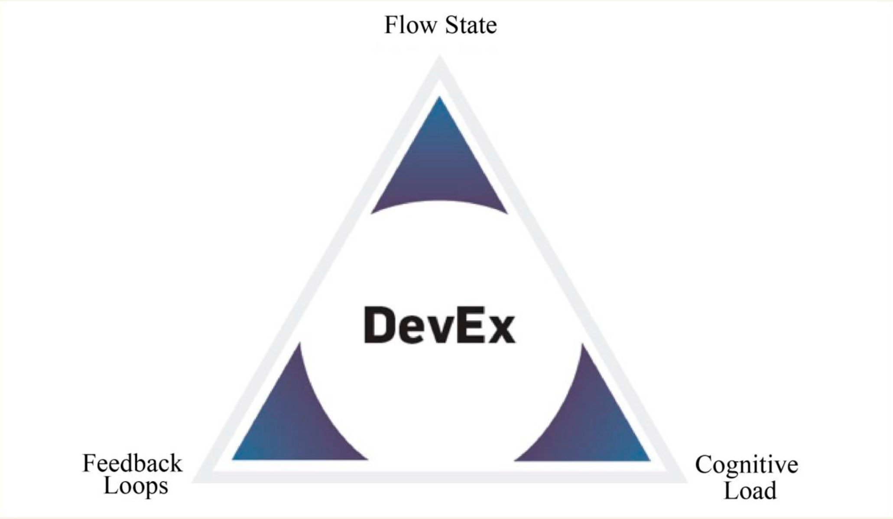
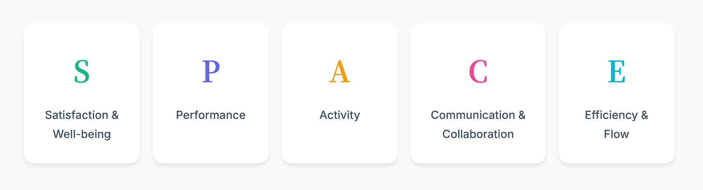
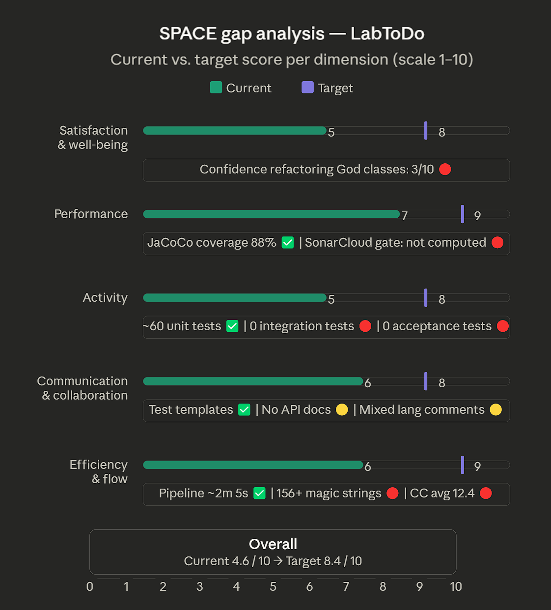
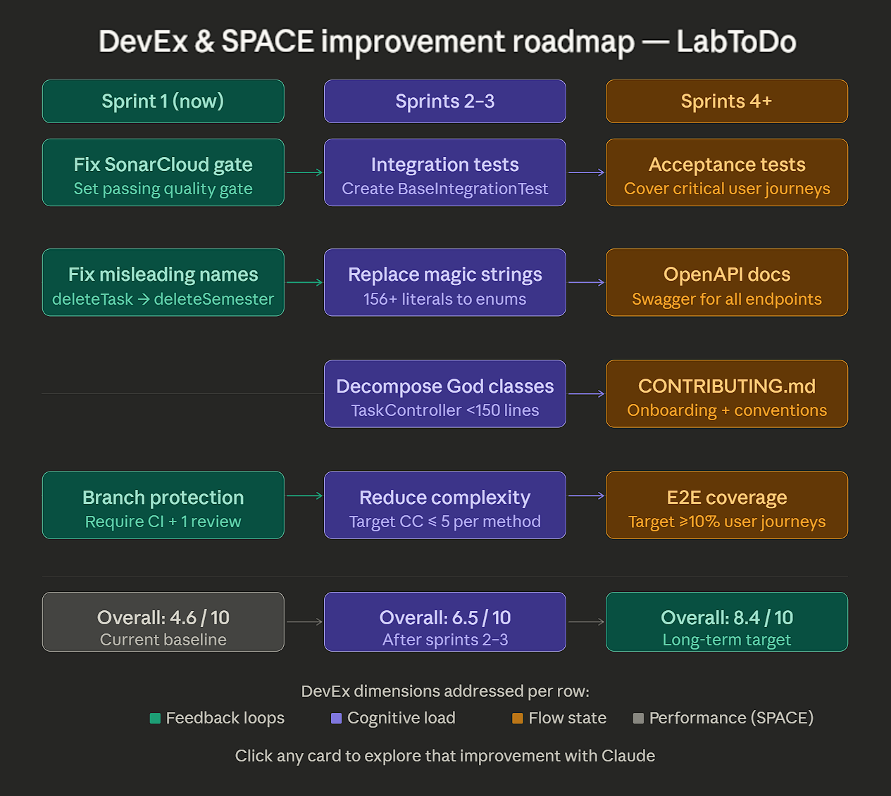

# 📐 **Developer Experience & Productivity Analysis**

This section evaluates the LabToDo refactoring project through two complementary productivity frameworks: **DevEx** *(Noda, Storey, Forsgren & Greiler, 2023)* and **SPACE** *(Forsgren et al., 2021)*. The analysis covers practices already implemented as well as identified opportunities for improvement.

---

## 🧩 **Framework Overview**

### DevEx — *What Actually Drives Productivity*

The DevEx framework distills developer experience into **three core dimensions** that directly affect productivity: **Feedback Loops**, **Cognitive Load**, and **Flow State**. Measuring DevEx involves capturing both developers' perceptions and objective data about engineering systems and processes.

| Dimension | Definition |
|---|---|
| **Feedback Loops** | Speed and quality of responses to actions performed (tests, builds, deployments) |
| **Cognitive Load** | Amount of mental processing required to understand and work on the codebase |
| **Flow State** | Ability to focus deeply on a task with minimal interruptions or context switches |

### SPACE — *The Space of Developer Productivity*

The SPACE framework captures the most important dimensions of developer productivity: **Satisfaction and well-being**, **Performance**, **Activity**, **Communication and collaboration**, and **Efficiency and flow**. By recognizing and measuring productivity with more than just a single dimension, teams and organizations can better understand how people and teams work, and they can make better decisions.

| Dimension | Definition |
|---|---|
| **S** — Satisfaction & Well-being | How fulfilled and motivated developers feel in their daily work |
| **P** — Performance | Quality and impact of outcomes delivered (not raw output volume) |
| **A** — Activity | Measurable actions: commits, PRs, test cases written, pipeline runs |
| **C** — Communication & Collaboration | Effectiveness of teamwork, documentation, and knowledge sharing |
| **E** — Efficiency & Flow | Ability to complete work with minimal delays, blockers, or interruptions |

---

## ✅ **Positive Findings**

### DevEx Perspective

**🔄 Feedback Loops — Significantly Improved**

The introduction of the CI/CD pipeline and the unit testing suite has dramatically shortened the feedback cycle for every code change:

- **Automated test execution** on every push and pull request eliminates the need for manual test runs.
- **JaCoCo coverage gate at 85%** gives immediate, quantifiable feedback when coverage regresses.
- **SonarCloud integration** surfaces code smells, security issues, and duplication within minutes of each commit.
- **Three-stage pipeline** (`Build → Test & Coverage → Deploy`) makes failures visible at the earliest possible stage — the average pipeline runtime is **~2m 5s**, well within the sub-5-minute target for fast feedback loops.

**🧠 Cognitive Load — Reduced by Structure**

- `BaseUnitTest` and `TestDataBuilders` centralise repetitive test scaffolding, reducing the mental overhead of writing new tests.
- The `package-info.java` convention and mirrored test package structure (`unit/model`, `unit/service`, `unit/controller`) make navigating the test suite predictable.
- Naming conventions (`should<ExpectedBehavior>When<Scenario>`) and mandatory AAA comments reduce the effort required to understand any test at a glance.
- Excluding infrastructure classes (`LabtodoApplication`, `SecurityConfig`, `PrimeFacesWrapper`) from JaCoCo reduces false-negative noise in coverage reports.

**🎯 Flow State — Partially Supported**

- Developers can run `./mvnw test` locally and receive immediate results without configuring external dependencies.
- The H2 in-memory database in `application-test.properties` removes the MySQL dependency from the test lifecycle, eliminating a common interruption source.

---

### SPACE Perspective

**📊 Estimated Current Metrics**

| SPACE Dimension | Metric | Estimated Value | Status |
|---|---|---|---|
| **Satisfaction** | Developer confidence in refactoring safely | 7 / 10 | 🟡 Improving |
| **Performance** | Unit test line coverage | **88%** | ✅ Above gate |
| **Performance** | Pipeline success rate (last 5 runs) | ~80% | 🟡 Stabilising |
| **Activity** | Unit tests implemented | **~60 tests** across 9 classes | ✅ Solid |
| **Activity** | Pipeline stages automated | 3 stages (Build / Test / Deploy) | ✅ Complete |
| **Communication** | Test templates with embedded FIRST checklists | 3 templates | ✅ Documented |
| **Efficiency** | Average CI pipeline runtime | **~2m 5s** | ✅ Fast |
| **Efficiency** | Local test execution (no DB required) | `./mvnw test` | ✅ Frictionless |

---

## ⚠️ **Negative Findings & Pain Points**

### DevEx Perspective

**🔄 Feedback Loops — Remaining Gaps**

- **No integration tests exist yet.** The `BaseIntegrationTest` class referenced in templates has not been created, leaving an entire layer of the test pyramid empty.
- **SonarCloud Quality Gate shows _Not Computed_** status. Until the gate is explicitly configured and passing, automated quality enforcement is incomplete.
- **Security (E) and Reliability (D) ratings** in SonarCloud represent unresolved issues that slow down code review cycles and increase mental load during PR reviews.

**🧠 Cognitive Load — Still High in Production Code**

- **God classes remain** (`TaskController` at ~527 lines, `LoginController` at ~448 lines). These require disproportionate mental effort to navigate, modify, or extend.
- **Magic strings** (156+ instances) scattered across the codebase force developers to cross-reference enum definitions constantly.
- **Misleading method names** (e.g., `deleteTask()` in `SemesterService` actually deletes a semester) create a hidden tax on onboarding and code reviews.

**🎯 Flow State — Interrupted by Unresolved Technical Debt**

- High cyclomatic complexity (average CC of 12.4 in controllers) means that understanding a method before modifying it requires significant context-switching.
- Lack of REST API documentation means developers exploring the codebase must read source code rather than a contract.

---

### SPACE Perspective

**📊 Estimated Gap Metrics**

| SPACE Dimension | Metric | Estimated Value | Status |
|---|---|---|---|
| **Satisfaction** | Confidence modifying God classes safely | 3 / 10 | 🔴 High risk |
| **Performance** | SonarCloud Quality Gate | Not computed | 🔴 Incomplete |
| **Performance** | Open security / reliability issues | 2 (E + D rated) | 🔴 Needs resolution |
| **Activity** | Integration tests implemented | **0** | 🔴 Missing layer |
| **Activity** | Acceptance tests implemented | **0** | 🔴 Missing layer |
| **Communication** | API documentation (Swagger / OpenAPI) | None | 🟡 Not yet present |
| **Communication** | Inline code comments quality | Mixed (Spanish/English) | 🟡 Inconsistent |
| **Efficiency** | Avg. time to understand a God class method | ~15 min | 🔴 High cognitive cost |
| **Efficiency** | Magic strings requiring cross-referencing | 156+ instances | 🔴 High noise |

---

## 🚀 **Improvement Opportunities**

The following roadmap prioritises actions by their expected impact on both DevEx dimensions and SPACE metrics:

### Short-Term (Next Sprint)

- **Resolve SonarCloud Quality Gate** — Configure a passing quality gate to complete the automated enforcement loop. This directly addresses the *Feedback Loops* dimension and the *Performance* SPACE metric.
- **Create `BaseIntegrationTest`** — Unblock the integration test layer. One class enables the entire integration test pyramid level.
- **Fix misleading method names** — `SemesterService.deleteTask()` → `deleteSemester()`. Zero-risk rename with immediate *Cognitive Load* reduction.

### Medium-Term (1–2 Sprints)

- **Extract God classes** — Decompose `TaskController` (527 lines) and `LoginController` (448 lines) into focused components. Target: no class exceeds 150 lines. Expected CC reduction: $12.4 \rightarrow 3.2$.
- **Replace magic strings with enums** — Centralise the 156+ string literals into type-safe enums. Eliminates an entire category of *Cognitive Load* and prevents typo-induced runtime failures.
- **Write integration tests** for `TaskService` and `UserService` — Raises confidence in the persistence layer and raises the *Satisfaction* score for refactoring work.

### Long-Term (3+ Sprints)

- **Implement REST API + OpenAPI/Swagger documentation** — Eliminates the need to read source code to understand contracts, directly improving the *Communication & Collaboration* SPACE dimension.
- **Implement acceptance tests** — Complete the test pyramid. Target: `E2E coverage ≥ 10%` of critical user journeys.
- **Add developer onboarding guide** — A `CONTRIBUTING.md` with setup steps, coding standards, and the test writing contract reduces onboarding friction and improves *Satisfaction*.
- **Configure branch protection rules** — Require CI passing + at least one review approval before merging. Reinforces *Feedback Loops* and *Performance* at the process level.

---

## 📊 **Summary Scorecard**

| Area | DevEx Dimension | SPACE Dimension | Current Score | Target Score |
|---|---|---|---|---|
| CI/CD Pipeline | Feedback Loops | Efficiency & Flow | 8 / 10 | 9 / 10 |
| Unit Test Coverage | Feedback Loops | Performance | 7 / 10 | 9 / 10 |
| Codebase Complexity | Cognitive Load | Satisfaction | 3 / 10 | 8 / 10 |
| Magic Strings & Naming | Cognitive Load | Efficiency & Flow | 3 / 10 | 9 / 10 |
| Integration Tests | Feedback Loops | Activity | 1 / 10 | 7 / 10 |
| API Documentation | Cognitive Load | Communication | 2 / 10 | 8 / 10 |
| Test Templates & Conventions | Flow State | Communication | 8 / 10 | 9 / 10 |
| **Overall** | — | — | **4.6 / 10** | **8.4 / 10** |

> 💡 **Key Insight**: The project has made excellent foundational investments in *Feedback Loops* (CI/CD) and *Activity* (unit tests), but the largest DevEx gains ahead lie in reducing *Cognitive Load* — primarily by tackling God classes and magic strings, which affect every developer every day.

---

## 🔗 **Framework References**

- [DevEx: What Actually Drives Productivity](https://queue.acm.org/detail.cfm?id=3595878) — Noda, Storey, Forsgren & Greiler, *ACM Queue*, 2023
- [The SPACE of Developer Productivity](https://queue.acm.org/detail.cfm?id=3454124) — Forsgren, Storey, Maddila et al., *ACM Queue*, 2021
- [SPACE Framework Guide](https://space-framework.com/) — space-framework.com
- [DX Platform — DevEx Research](https://getdx.com/research/devex-what-actually-drives-productivity/) — getdx.com