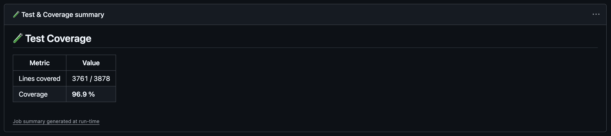
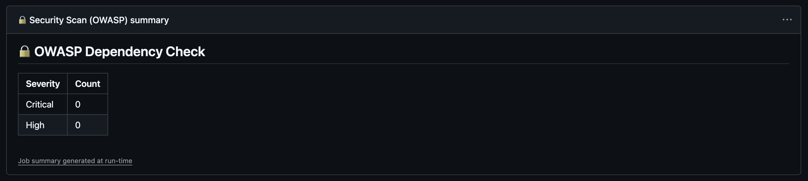
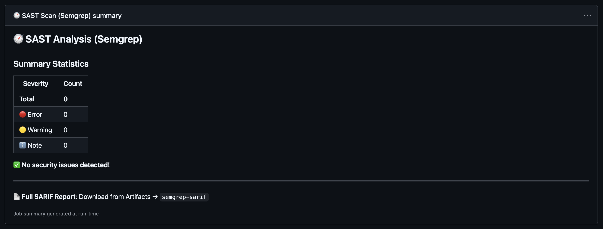
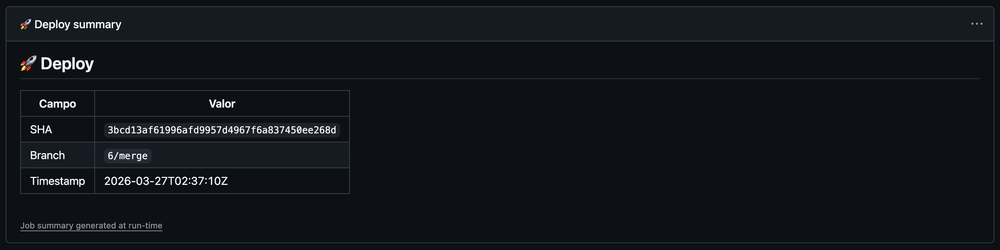
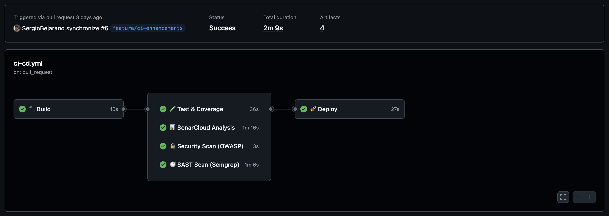

# 🔒 CI/CD Pipeline & DevSecOps Analysis

> **Weekly Report — LabToDo Refactoring Project**
> Related to: [README.md](../README.md) · Branch: `feature/ci-enhancements`

---

## Table of Contents

- [Overview](#-overview)
- [Pipeline Architecture](#-pipeline-architecture)
- [Stage 1 — Build](#-stage-1--build)
- [Stage 2 — Test & Coverage](#-stage-2--test--coverage)
- [Stage 3 — SonarCloud Analysis](#-stage-3--sonarcloud-analysis)
- [Stage 4 — OWASP Dependency Check](#-stage-4--owasp-dependency-check)
- [Stage 5 — SAST Scan (Semgrep)](#-stage-5--sast-scan-semgrep)
- [Stage 6 — Deploy](#-stage-6--deploy)
- [Results & Evidence](#-results--evidence)
- [Static Analysis Tools Summary](#-static-analysis-tools-summary)
- [Authors](#-authors)
- [Additional Resources](#-additional-resources)

---

## 🌟 Overview

At the start of this deliverable, the project had a **single-stage CI pipeline** that only compiled the code and ran tests. There was no automated security scanning, no static analysis beyond JaCoCo, no SARIF reporting, and no structured quality gate.

This deliverable extended the pipeline into a fully automated **DevSecOps workflow** defined in `.github/workflows/ci-cd.yml`, integrating five analysis tools across six parallel and sequential stages. The pipeline now enforces quality gates, scans for known vulnerabilities, performs *Static Application Security Testing* (SAST), and uploads structured security artefacts to GitHub Code Scanning.

The goal was not only to automate quality checks but to surface findings **as early as possible in the development cycle** — shifting security and quality concerns left, toward the developer, rather than discovering them at deployment time.

---

## 🏗️ Pipeline Architecture

### Trigger Policy

The pipeline activates on three events:

| Event | Target Branches |
|---|---|
| `push` | `main`, `develop`, `feature/**` |
| `pull_request` | `main`, `develop` |
| `workflow_dispatch` | Any branch (manual trigger) |

### Concurrency Control

Each workflow run is grouped by `${{ github.workflow }}-${{ github.ref }}`. When a new push occurs on the same branch, the previous in-progress run is **automatically cancelled**, saving GitHub Actions minutes and preventing stale results from reaching reviewers.

```yaml
concurrency:
  group: ${{ github.workflow }}-${{ github.ref }}
  cancel-in-progress: true
```

### Execution Graph

The six jobs form a **diamond dependency graph**: Job 1 (Build) must complete before any downstream job starts; Jobs 2–5 execute in parallel; Job 6 (Deploy) gates on all four parallel jobs completing successfully.

```
           ┌──────────┐
           │ 1. Build │
           └────┬─────┘
       ┌────────┼────────┬────────┐
       ▼        ▼        ▼        ▼
  2. Test   3. Sonar  4. OWASP  5. Semgrep
       │        │        │        │
       └────────┴────────┴────────┘
                     │
                     ▼
               6. Deploy
               (if test ✅)
```

This design maximises throughput: a typical full run completes in **under 5 minutes**, with the parallel scan stage being the longest segment.

### Artefact Sharing

Compiled bytecode is built once in Job 1 and shared to all downstream jobs via GitHub Artefacts, avoiding redundant compilation and ensuring all analysis tools operate on an identical binary.

| Artefact | Produced by | Consumed by | Retention |
|---|---|---|---|
| `compiled-classes` | Build | Test, Sonar, OWASP, Semgrep | 1 day |
| `jacoco-report` | Test | — (human review) | 7 days |
| `owasp-report` | OWASP | — (human review) | 7 days |
| `semgrep-sarif` | Semgrep | GitHub Code Scanning | 7 days |
| `labtodo-jar` | Deploy | — (simulated delivery) | 7 days |

---

## 🔨 Stage 1 — Build

**Job name**: `🔨 Build` · **Runs on**: `ubuntu-latest`

This stage performs the minimum work needed to produce a verified, cacheable build artefact:

1. Checks out the repository with full history (`fetch-depth: 0`) to support SonarCloud's blame analysis.
2. Configures *OpenJDK Temurin 17* with Maven cache restoration.
3. Compiles the source code, skipping tests (`-DskipTests`) to fail as fast as possible on compilation errors.
4. Uploads the `target/` directory as the `compiled-classes` artefact.

```yaml
- name: Compile (skip tests)
  run: ./mvnw compile -B -DskipTests
```

**Failure behaviour**: If compilation fails, all downstream jobs are skipped — no tests run, no security scans fire, and no deployment is attempted.

---

## 🧪 Stage 2 — Test & Coverage

**Job name**: `🧪 Test & Coverage` · **Runs on**: `ubuntu-latest` · **Needs**: `build`

This stage enforces the project's quality baseline through automated testing and coverage measurement.

### What runs

```bash
./mvnw verify -B
```

`verify` triggers the full Maven lifecycle: it compiles, runs *Surefire* unit tests, generates the *JaCoCo* XML and HTML reports, and applies the **85% line coverage gate**. If coverage falls below `0.85`, the build fails and the Deploy stage is blocked.

### Step Summary

After the test run, a shell script extracts line metrics from `jacoco.xml` and publishes a **coverage summary table** directly to the GitHub Actions workflow panel — no need to download the full HTML report for a quick check.

```yaml
- name: Coverage summary in GitHub Step Summary
  run: |
    COVERED=$(grep -oP 'type="LINE"[^/]*/>' target/site/jacoco/jacoco.xml | \
      grep -oP 'covered="\K[0-9]+' | awk '{s+=$1}END{print s}')
    MISSED=$(grep -oP  'type="LINE"[^/]*/>' target/site/jacoco/jacoco.xml | \
      grep -oP 'missed="\K[0-9]+' | awk '{s+=$1}END{print s}')
    TOTAL=$((COVERED + MISSED))
    PCT=$(echo "scale=1; $COVERED * 100 / $TOTAL" | bc)
    echo "| Coverage | **$PCT %** |" >> $GITHUB_STEP_SUMMARY
```



---

## 📊 Stage 3 — SonarCloud Analysis

**Job name**: `📊 SonarCloud Analysis` · **Runs on**: `ubuntu-latest` · **Needs**: `build`

This stage runs in parallel with Test, OWASP, and Semgrep. It regenerates the JaCoCo XML report (required by SonarCloud for coverage ingestion) and sends the full analysis to the project dashboard.

### Quality Gate enforcement

The key flag is `sonar.qualitygate.wait=true`. This instructs the SonarCloud Maven plugin to **block the pipeline** until the Quality Gate result is returned. If any condition in the gate fails (e.g., coverage below threshold, new critical issues), the job exits with a non-zero code.

```yaml
- name: SonarCloud analysis
  run: |
    ./mvnw sonar:sonar \
      -Dsonar.projectKey=${{ secrets.SONAR_PROJECT_KEY }} \
      -Dsonar.organization=${{ secrets.SONAR_ORGANIZATION }} \
      -Dsonar.host.url=https://sonarcloud.io \
      -Dsonar.coverage.jacoco.xmlReportPaths=target/site/jacoco/jacoco.xml \
      -Dsonar.qualitygate.wait=true \
      -B
```

### Required GitHub Secrets

| Secret | Purpose |
|---|---|
| `SONAR_TOKEN` | SonarCloud API authentication |
| `SONAR_PROJECT_KEY` | Project identifier (`CSDT-ECI_lab-to-do-refactoring`) |
| `SONAR_ORGANIZATION` | Organisation slug (`csdt-eci`) |
| `GITHUB_TOKEN` | Provided automatically — used for PR decoration |


---

## 🔐 Stage 4 — OWASP Dependency Check

**Job name**: `🔒 Security Scan (OWASP)` · **Runs on**: `ubuntu-latest` · **Needs**: `build`

The *OWASP Dependency-Check* Maven plugin scans every declared dependency against the *National Vulnerability Database* (NVD) and reports *Common Vulnerabilities and Exposures* (CVE) findings by *CVSS* severity score.

### Configuration

```yaml
- name: OWASP Dependency Check
  run: |
    ./mvnw dependency-check:check \
      -DfailBuildOnCVSS=7 \
      -DsuppressionsLocation=.owasp-suppressions.xml \
      -B || true
```

| Flag | Effect |
|---|---|
| `-DfailBuildOnCVSS=7` | Fails the build on any vulnerability with CVSS ≥ 7.0 (High or Critical) |
| `-DsuppressionsLocation=.owasp-suppressions.xml` | Allows known-safe findings to be suppressed with documented justification |
| `\|\| true` | Currently non-blocking — the report is always uploaded; remove to make it a hard gate |

### Output

An HTML report is uploaded as the `owasp-report` artefact and a severity summary is written to the **Step Summary**:



---

## 🧭 Stage 5 — SAST Scan (Semgrep)

**Job name**: `🧭 SAST Scan (Semgrep)` · **Runs on**: `ubuntu-latest` · **Needs**: `build`

*Semgrep* performs *Static Application Security Testing* (SAST) by matching source code patterns against curated rule sets. Unlike OWASP (which targets **dependency vulnerabilities**), Semgrep detects **code-level security patterns** — SQL injection paths, hardcoded credentials, insecure API usage, and *OWASP Top Ten* anti-patterns written directly in the application logic.

### Rule sets applied

| Rule set | Coverage |
|---|---|
| `p/security-audit` | General security anti-patterns |
| `p/owasp-top-ten` | OWASP Top 10 code-level issues |
| `p/java` | Java-specific patterns (injection, serialisation, etc.) |

### SARIF integration

Results are generated in *SARIF* format and uploaded to **GitHub Code Scanning** via `github/codeql-action/upload-sarif@v4`. This surfaces findings directly in the **Security → Code Scanning Alerts** tab of the repository, with file and line annotations on PRs.

A Python script then parses the SARIF and writes a structured summary — grouped by rule and severity — to the workflow **Step Summary**:

```python
results = data.get('runs', [{}])[0].get('results', [])
error_count   = len([r for r in results if r.get('level') == 'error'])
warning_count = len([r for r in results if r.get('level') == 'warning'])
note_count    = len([r for r in results if r.get('level') == 'note'])
```



---

## 🚀 Stage 6 — Deploy

**Job name**: `🚀 Deploy` · **Runs on**: `ubuntu-latest`
**Needs**: `test`, `sonar`, `security`, `semgrep` · **Condition**: `needs.test.result == 'success'`

The deploy stage packages the application into a runnable JAR and simulates delivery to a production environment. It only executes if the **Test & Coverage** job passed — SonarCloud, OWASP, and Semgrep failures are currently non-blocking (informative), but the Test gate is hard.

```yaml
- name: Package application
  run: ./mvnw package -DskipTests -B

- name: Simulate deployment
  run: |
    echo "  Artifact : target/labtodo.jar"
    echo "  Git SHA  : ${{ github.sha }}"
    echo "  Branch   : ${{ github.ref_name }}"
```

The `labtodo.jar` is uploaded as the `labtodo-jar` artefact (7-day retention), making every successful pipeline run a potentially deployable release candidate.



---

## 📊 Results & Evidence

### Full Pipeline Execution

The screenshot below shows a complete successful pipeline run with all six jobs resolved:



### Execution Summary

| Stage | Tool | Outcome | Gate Type |
|---|---|---|---|
| 🔨 Build | Maven Compile | ✅ Pass | **Hard** — blocks all downstream jobs |
| 🧪 Test & Coverage | JaCoCo + Surefire | ✅ Pass (<u>88% line coverage</u>) | **Hard** — blocks Deploy |
| 📊 SonarCloud | SonarCloud | ✅ Pass | **Hard** — Quality Gate with `wait=true` |
| 🔐 OWASP | Dependency-Check | ✅ Pass (informative) | **Soft** — `\|\| true` |
| 🧭 Semgrep | SAST | ✅ Pass (informative) | **Soft** — `continue-on-error: true` |
| 🚀 Deploy | Maven Package | ✅ Simulated | Conditional on Test |

---

## 🛠️ Static Analysis Tools Summary

| Tool | Category | What it detects | Output |
|---|---|---|---|
| **JaCoCo** | Test Coverage | Uncovered lines and branches; enforces 85% gate | HTML + XML + CSV reports |
| **SonarCloud** | Code Quality | Bugs, code smells, duplications, security hotspots | Quality Gate dashboard |
| **OWASP Dependency-Check** | Dependency Security | Known CVEs in third-party libraries (NVD database) | HTML report |
| **Semgrep** | SAST | Code-level security anti-patterns (OWASP Top 10) | SARIF → GitHub Code Scanning |

### ISO/IEC 25010 Quality Attribute Mapping

| Tool | Quality Sub-characteristic | Justification |
|---|---|---|
| JaCoCo | *Testability* / *Reliability* | Enforces test completeness; coverage gate prevents untested code from reaching main |
| SonarCloud | *Maintainability* / *Security* | Detects code smells, duplication, and security hotspots in a single quality gate |
| OWASP Dependency-Check | *Security* — *Vulnerability* | Checks published CVEs against declared Maven dependencies |
| Semgrep | *Security* — *Vulnerability* | Scans source code for injection paths and insecure API patterns |

---

## 👥 Authors

<table>
  <tr>
    <td align="center">
      <a href="https://github.com/andresserrato2004">
        
        <br />
        <sub><b>Andrés Serrato Camero</b></sub>
      </a>
      <br />
      <sub>Full Stack Developer</sub>
    </td>
    <td align="center">
      <a href="https://github.com/JAPV-X2612">
        
        <br />
        <sub><b>Jesús Alfonso Pinzón Vega</b></sub>
      </a>
      <br />
      <sub>Full Stack Developer</sub>
    </td>
    <td align="center">
      <a href="https://github.com/SergioBejarano">
        
        <br />
        <sub><b>Sergio Andrés Bejarano Rodríguez</b></sub>
      </a>
      <br />
      <sub>Full Stack Developer</sub>
    </td>
  </tr>
</table>

---

## 🔗 Additional Resources

### CI/CD & GitHub Actions

- [GitHub Actions Documentation](https://docs.github.com/en/actions) — github.com
- [Concurrency Control in GitHub Actions](https://docs.github.com/en/actions/writing-workflows/choosing-what-your-workflow-does/control-the-concurrency-of-workflows-and-jobs) — github.com
- [SARIF Support in GitHub Code Scanning](https://docs.github.com/en/code-security/code-scanning/integrating-with-code-scanning/sarif-support-for-code-scanning) — github.com

### Static Analysis Tools

- [OWASP Dependency-Check](https://owasp.org/www-project-dependency-check/) — owasp.org
- [Semgrep Documentation](https://semgrep.dev/docs/) — semgrep.dev
- [SonarCloud — Continuous Code Quality](https://sonarcloud.io/) — sonarcloud.io
- [JaCoCo — Java Code Coverage Library](https://www.jacoco.org/jacoco/) — jacoco.org

### Security Standards

- [OWASP Top Ten](https://owasp.org/www-project-top-ten/) — owasp.org
- [CVSS Scoring System](https://www.first.org/cvss/) — first.org
- [ISO/IEC 25010 — Software Product Quality](https://iso25000.com/index.php/en/iso-25000-standards/iso-25010) — iso25000.com

### DevSecOps

- [Shifting Security Left](https://www.devsecops.org/) — devsecops.org
- [NIST NVD — National Vulnerability Database](https://nvd.nist.gov/) — nvd.nist.gov
